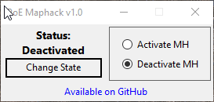

# Path of Exile 2: Maphack
Path of Exile 2 - Maphack
This program allows you to reveal the map of a location by modifying values in the RAM of the running game client. The program works locally and interacts only with the active Path of Exile 2 game client.

- The program features a simple interface that allows you to activate or deactivate the revealing of location maps in the game. Once revealed, maps remain open even after deactivation, but subsequent maps will not be revealed until you reactivate the maphack.
  
 
- The program minimizes to the system tray and hides from the taskbar, but remains accessible via the notification icon. Right-clicking the icon brings up a context menu that allows you to activate, deactivate the maphack, or completely exit the program.
> To avoid interacting with the program using the mouse, it tracks the pressing of the F9 key on the keyboard. Pressing F9 toggles the maphack on or off, accompanied by a sound notification indicating whether the maphack has been activated or deactivated.

> The program does not perform its function unless the game is running, so it does not burden the system or track the F9 key press when the game is not active.
# ⚠️ **IMPORTANT!** Please pay attention!
The program is distributed "As Is." Any modification to the game client's memory may affect the program's functionality and the game client itself, and could lead to your account being banned. Therefore, use the maphack at your own risk!
